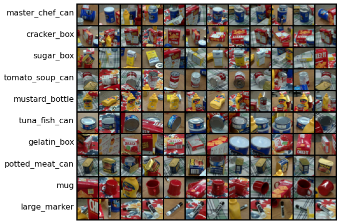
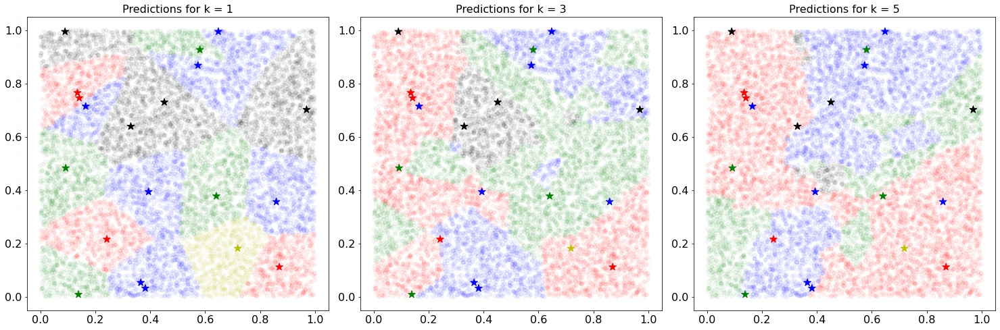
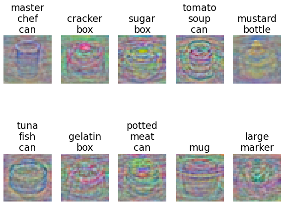
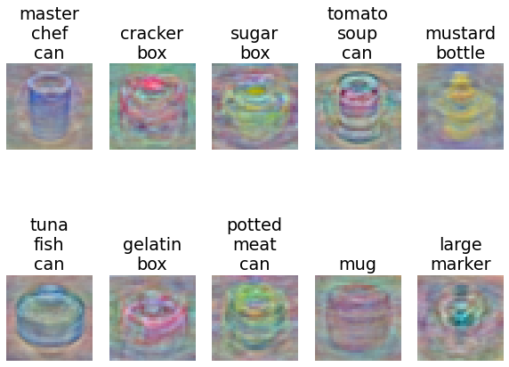
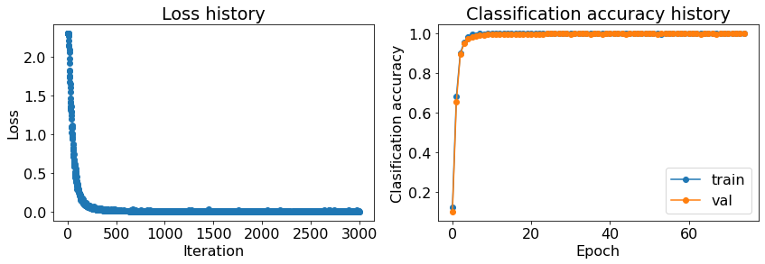
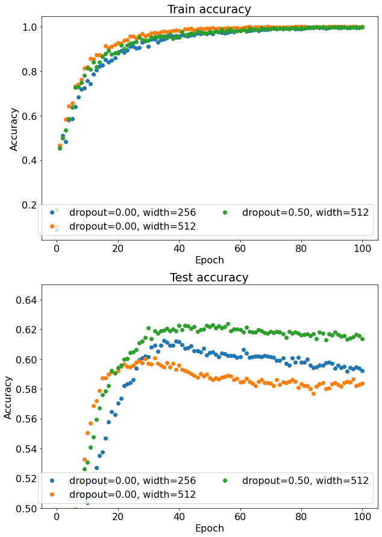
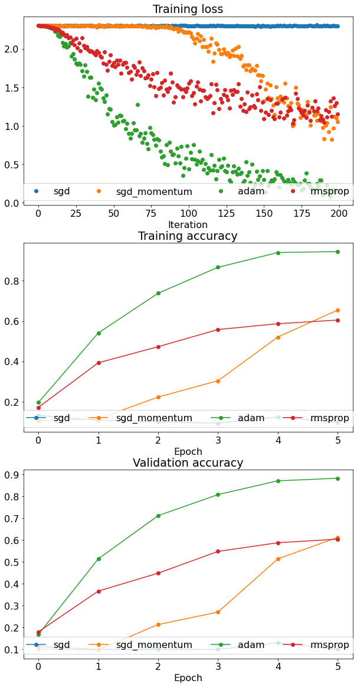

## 🤖 Image-classification 
- Here, I present two different categories of machine learning models for image classification on a recently released (as of 2023) 'PROPS Classification Dataset', consisting of 10 popolar household items. The directory 'Without Neural Networks' consists of three types of image classifiers: K-Nearest Neighbors classifier, Multiclass Support Vector Machine classifier, and a Softmax classifier. 
- On the other hand the directory 'With Neural Networks' consists of neural network based implementations for the same image classification task.
- The objective of this project was to gain an in-depth understanding of building a machine learning pipeline from scratch that can be used to train and evaluate image classification models. In this project I have implemented a set of classification models then applied them to a dataset of images (PROPS Classification Dataset) in the context of domestic service robots. This also involved experimenting with various optimizers, and regularization techniques. 

### 🎯 Goals of this project
Without Neural Networks
* Implement a K-Nearest Neighbors classifier.
* Implement a Multiclass Support Vector Machine classifier.
* Implement a Softmax classifier.
* Understand the differences and tradeoffs between each of these classifiers.
* Understand the characteristics of instance-level classification using the PROPS Classification Dataset.
* Practice with cross validating your machine learning models.

With Neural Networks
* Implement the forward and backward pass for a two layer neural network.
* Generalize the two-layer network implementation to fully connected layers.
* Implement the forward and backward pass for a non-linear activation function (ReLU).
* Implement and understand the tradeoffs using network regularization techniques.
* Understand the characteristics of neural network based classification using the PROPS Classification Dataset.

## 🗂️ Dataset
- The PROPS Classification dataset contains 10 object categories with 50K training images and 10K testing images. Each image in the dataset is a 32x32 RGB color image. All images in the test set are taken from scenes not represented in the training set. 
- The dataset is available for download on https://drive.google.com/file/d/1C8_JFsnPVm392C-S1rH0y4HFfNkdMlXi/view?usp=share_link. Extract & place the dataset inside the directories ('Without Neural Networks' & 'With Neural Networks'). 
- Sample images of each category in the PROPS Classification dataset are included below:

## 🛠️ Test/Demo
- K-Nearest Neighbors (KNN) classifier
    - Go to the directory 'Without Neural Networks', and launch the jupyter notebook 'knn.ipynb'
- Multiclass Support Vector Machine (SVM) classifier &/or Softmax Classifier
    - Go to the directory 'Without Neural Networks', and launch the jupyter notebook 'linear_classifier.ipynb'
- Two-layer neural network classifier
    - Go to the directory 'With Neural Networks', and launch the jupyter notebook 'two_layer_net.ipynb'
- Multi-layer neural network
    - Go to the directory 'With Neural Networks', and launch the jupyter notebook 'fully_connected_networks.ipynb'

## 📊 Results

- Note: During validation/cross-validation for hyperparameter tuning, the training dataset comprises of 40K images, and 10K for validation. During testing, the training is done on 50K images and testing on out-of-distribution images comprising an additional 10K images.

### KNN 
K-Nearest Neighbors (KNN) classifier, with k=1, achieved a classification accuracy of 97.4% on the validation dataset and 53.14% on the test images. To visualize how KNN's predictions typically look & how do they vary with the hyperparameter k, below I've presented results when the classifier was only trained on 20 training images. The points marked with '*' are the training images, and all other points 'o' are the testing images. Since it's pretty cumbersome to show 50K images as points on the same plot, so only 20 training images were chosen. Here different colors represent different classes, for this visualization we chose 5 of the 10 classes in the dataset.

### Multiclass SVM
Multiclass Support Vector Machine classifier, achieved a classification accuracy of 96.05% on the validation dataset and 57.12% on the test images. Below are the visualizations of the learned weights for each of the 10 classes. 

### Softmax
Softmax classifier, achieved a classification accuracy of 89.73% on the validation dataset and 59.77% on the test images. Below are the visualizations of the learned weights for each of the 10 classes. 

### Two-layer neural network 
The two-layer neural network implementation achieved a classification accuracy of 99.5% on the validation dataset, and 62.3% on the test images. Below are the training loss plots, and accuracy plots.

Below are some plots showing the effect of dropout regularization, and size of hidden layers, when the training data was kept as 20K images. 

### Multi-layer neural network
The five-layer neural network implementation was first trained over 4K training images, with the aim of studying of different optimizers on the classification accuracy. Below are the training loss plots, and accuracy plots. 

 
Later with training over the entire dataset (& better hyperparams), it achieved an accuracy of 99.85% on the validation dataset, and 62.7% on the test dataset.
