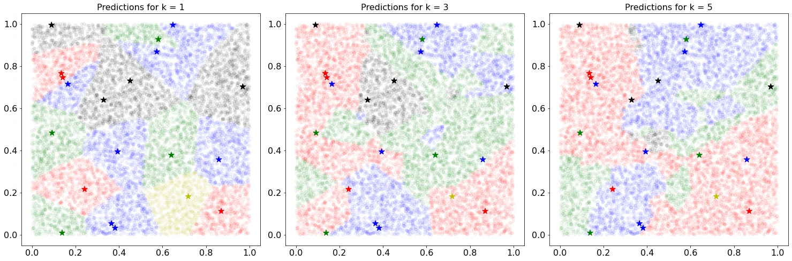
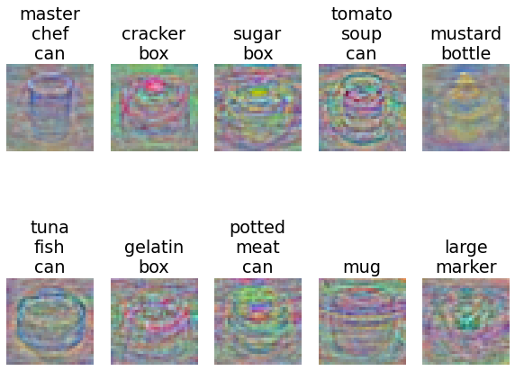

# Image-classification
The objective of this project was to gain experience building a machine learning pipeline that can be used to train and evaluate image classification models. In this project I have implemented a set of classification models then applied them to a dataset of images (PROPS Classification Dataset) in the context of domestic service robots.  
The 3 models implemented are K-Nearest Neighbors classifier, Multiclass Support Vector Machine classifier, and a Softmax classifier. I also provide the trained weights for the later two models. To test/train the KNN classifier, please run the 'knn.ipynb' notebook, whereas the other two classifiers can be trained/tested through 'linear_classifier.ipynb' notebook. 
# Dataset
The PROPS Classification dataset contains 10 object categories with 50K training images and 10K testing images. Each image in the dataset is a 32x32 RGB color image. All images in the test set are taken from scenes not represented in the training set. 
The dataset is available for download on https://drive.google.com/file/d/1C8_JFsnPVm392C-S1rH0y4HFfNkdMlXi/view?usp=share_link  
Sample images of each category in the PROPS Classification dataset are included below:

# Results
## KNN 
K-Nearest Neighbors (KNN) classifier, with k=1, achieved a classification accuracy of 53.14% on the 10K test images. To visualize how KNN's predictions typically look & how do they vary with the hyperparameter k, below I've presented results when the classifier was only trained on 20 training images. The points marked with '*' are the training images, and all other points 'o' are the testing images. Since it's pretty cumbersome to show 50K images as points on the same plot, so only 20 training images were chosen. Here different colors represent different classes, for this visualization we chose 5 of the 10 classes in the dataset.

## Multiclass SVM
Multiclass Support Vector Machine classifier, achieved a classification accuracy of 57.12% on the 10K test images. Below are the visualizations of the learned weights for each of the 10 classes. 

## Softmax
Softmax classifier, achieved a classification accuracy of 59.77% on the 10K test images. Below are the visualizations of the learned weights for each of the 10 classes. 

