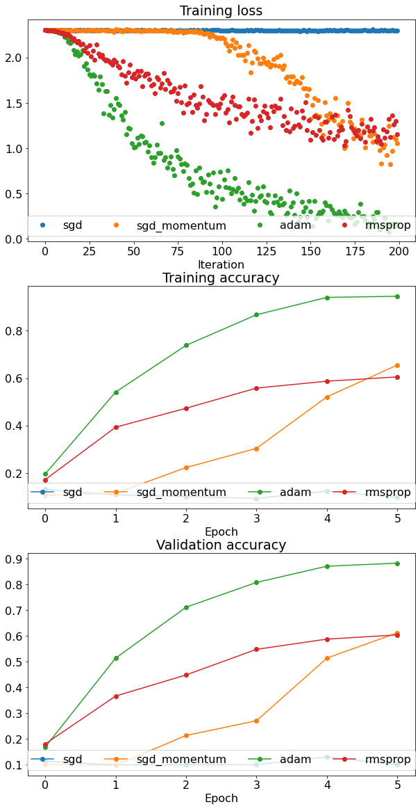

# Image-classification with neural networks
The objective of this project is to gain experience building and training neural networks as multi layer perceptrons. In this project I've implemented a fixed size two layer neural network and a set of generic network layers that can be used to build and train multi layer perceptrons. I also provide the trained weights for the two layer neural network. To test/train the two-layer neural network, please run the 'two_layer_net.ipynb' notebook, whereas the multi-layer perceptron can be trained/tested through 'fully_connected_networks.ipynb' notebook. 
# Goals of this project
* Implement the forward and backward pass for a two layer neural network.
* Generalize the two-layer network implementation to fully connected layers.
* Implement the forward and backward pass for a non-linear activation function (ReLU).
* Implement and understand the tradeoffs using network regularization techniques.
* Understand the characteristics of neural network based classification using the PROPS Classification Dataset.
# Dataset
The PROPS Classification dataset contains 10 object categories with 50K training images and 10K testing images. Each image in the dataset is a 32x32 RGB color image. All images in the test set are taken from scenes not represented in the training set. 
The dataset is available for download on https://drive.google.com/file/d/1C8_JFsnPVm392C-S1rH0y4HFfNkdMlXi/view?usp=share_link  
Sample images of each category in the PROPS Classification dataset are included below:

# Results
## Two-layer neural network 
The two-layer neural network implementation achieved a classification accuracy of 60.76% on the 10K test images. Below are the training loss plots, and accuracy plots.

Below are some plots showing the effect of dropout regularization, and size of hidden layers, when the training data was kept as 20K images.

## Multi-layer neural network
The five-layer neural network implementation was trained over 4K training images, with the aim of studying of different optimizers on the classification accuracy. Below are the training loss plots, and accuracy plots. 

